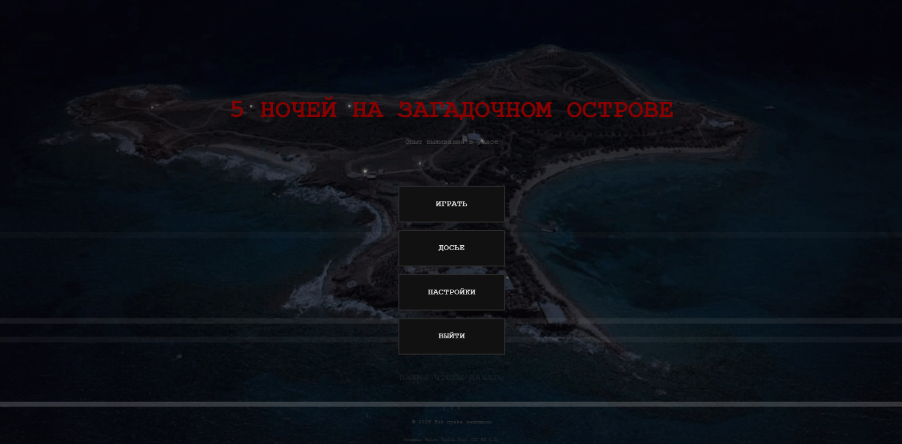
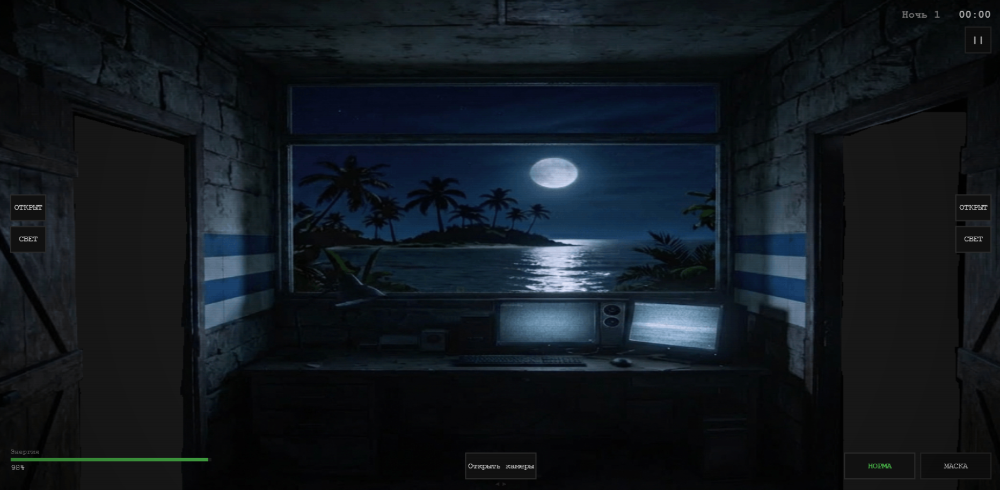
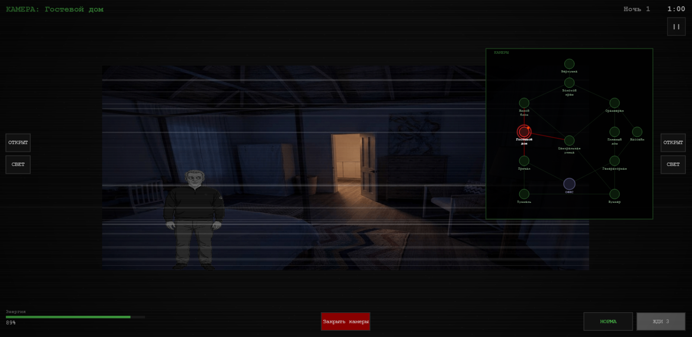

<div align="center">

# 🏝️ Island Night Watch

### A FNAF-inspired browser survival horror set on a mysterious private island

[](https://developer.mozilla.org/docs/Web/JavaScript)
[](https://developer.mozilla.org/docs/Web/API/Canvas_API)
[](https://developer.mozilla.org/docs/Web/CSS)
[](https://developer.mozilla.org/docs/Web/API/Web_Audio_API)
[](https://yandex.com/games/)
[](#technology-stack)
[](#ai-assisted-development)
[](#publication-and-moderation-status)
[](#project-status)
[](LICENSE)

<br>



</div>

---

## About the Game

**Island Night Watch** is a browser-based survival horror game inspired by the observation-and-resource-management gameplay of the *Five Nights at Freddy's* series.

The player takes the role of a night guard stationed in a security office on an isolated private island. To survive until morning, the player must monitor surveillance cameras, track approaching enemies, control doors and lights, use a disguise mask, maintain ventilation, conserve electrical power, and repair the generator when it begins to fail.

The campaign contains **seven nights** with gradually increasing difficulty. Each enemy follows an individual movement pattern and reacts differently to defensive systems such as lights, closed doors, and the mask.

The repository contains an essentially complete and playable game build, although some areas may still require balancing, polishing, and additional platform-specific testing.

---

## 🚫 Publication and Moderation Status

> [!IMPORTANT]
> Island Night Watch was developed for Yandex Games and submitted to the platform, but it did not pass moderation because of its subject matter and thematic content.

The game was not abandoned at the concept or prototype stage. The repository contains the near-complete build that was prepared for publication, including gameplay systems, content, localization, saving, advertisements, leaderboards, and Yandex Games SDK integration.

Because the submission was not approved, the game was never publicly released on Yandex Games.

The Yandex-specific code remains in the repository because platform integration was part of the original development process.

---

## 🎮 Gameplay

Survive seven increasingly difficult night shifts on the island.

During each night, the player must:

* monitor enemy movement through the camera network;
* switch between twelve surveillance locations;
* identify which enemies are approaching the office;
* close the correct door at the correct moment;
* use corridor lights to inspect blind spots;
* wear a disguise mask against enemies that react to it;
* remember that some enemies fear the mask, while others ignore it or become more aggressive;
* manage limited electrical power;
* maintain ventilation and oxygen;
* repair the generator through an interactive mini-game;
* deal with camera malfunctions;
* survive until the end of the shift.

Every defensive action has a cost or limitation. Keeping doors closed, using lights, watching cameras, and running office systems all affect the player's available resources.

<br>

<div align="center">




</div>

---

## ✨ Features

### Seven-Night Campaign

The game contains seven playable nights:

* Nights 1–6 gradually introduce new enemies and increase their aggression.
* Night 7 acts as a high-difficulty custom challenge.
* Night duration and enemy activation times are configured independently.
* Completed nights unlock further progression.

### Enemy AI

The game includes six enemy configurations with different:

* movement intervals;
* aggression levels;
* possible routes;
* preferred office side;
* reactions to lights;
* reactions to closed doors;
* reactions to the disguise mask;
* attack and retreat behaviour;
* movement bursts;
* activation times.

Enemy behaviour is driven by a state-based AI system with states such as:

```text
IDLE
PATROL
APPROACH
IN_TRANSIT
AT_DOOR
RETURNING
ATTACK
```

### Surveillance Network

The camera map covers twelve island locations:

* Helipad
* Golden Temple
* Staff Quarters
* Greenhouse
* Guest House
* Beach House
* Main Dock
* Generator Room
* Central Street
* Pool
* Tunnel
* Bunker

Several locations act as blind spots, making it harder to track approaching enemies.

### Security Office

The office provides interactive control over:

* left and right doors;
* left and right corridor lights;
* surveillance cameras;
* ventilation;
* disguise mask;
* generator access;
* power consumption.

### Generator Mini-Game

The generator requires manual maintenance during the night.

The player must rotate the mouse in a full circle within the time limit. The required direction can change between clockwise and counter-clockwise.

Failure to complete the mini-game can leave the player without enough power to maintain the office's defensive systems.

### Camera Malfunctions

Camera failures can interrupt surveillance and force the player to complete a separate repair interaction before the camera network becomes available again.

### Power and Oxygen Management

The player must balance defensive actions against limited resources.

Power consumption is affected by active systems, while ventilation influences the office's oxygen level. Excessive use of doors, lights, cameras, and other systems can create additional danger later in the night.

### Bestiary and Dossiers

The game contains a dossier-style bestiary with information about the enemies, their behaviour, and their possible weaknesses.

### Saving and Progression

The save system stores player progress, including completed and unlocked nights.

The project contains both local fallback logic and wrappers prepared for Yandex Games player-data integration.

### Russian and English Localization

The interface can be switched between Russian and English.

Localized content includes:

* menus;
* settings;
* HUD elements;
* room names;
* night-selection screens;
* game-over and victory screens;
* enemy dossiers;
* generator instructions.

### Yandex Games Integration

The repository contains wrappers for:

* Yandex Games SDK initialization;
* player data;
* cloud-oriented save operations;
* advertisements;
* rewarded advertisements;
* leaderboards;
* gameplay pause and resume events;
* platform lifecycle handling.

> [!NOTE]
> The integration was prepared for the submitted build, but the game was not published because it did not pass platform moderation.

---

## 🤖 AI-Assisted Development

Island Night Watch was created using free AI-assisted development tools, following an experimental workflow similar to the one used for [Slavic Dungeon](https://github.com/s7shvets7s/slavic-dungeon).

AI tools were used to assist with:

* project planning;
* gameplay-system implementation;
* generation of repetitive code;
* interface development;
* content organization;
* debugging;
* refactoring;
* asset-related workflows.

The project still required manual work in system design, integration, testing, gameplay balancing, bug fixing, and connecting independently generated components into a functional game.

The repository demonstrates both the strengths and the limitations of building a relatively large browser game through an AI-assisted workflow.

---

## 🛠️ Technology Stack

| Technology              | Purpose                                        |
| ----------------------- | ---------------------------------------------- |
| **HTML5**               | Application entry point and browser structure  |
| **CSS3**                | Full-screen presentation and responsive layout |
| **Vanilla JavaScript**  | Gameplay and application logic                 |
| **ES Modules**          | Modular source-code organization               |
| **Canvas 2D API**       | Game rendering                                 |
| **Web Audio API**       | Music, ambient sound, and sound effects        |
| **Yandex Games SDK v2** | Target-platform integration                    |
| **Browser Storage**     | Local save fallback                            |

The game intentionally uses:

* no frontend frameworks;
* no external game engine;
* no TypeScript;
* no bundler;
* no mandatory build step.

---

## 🏗️ Architecture

The project uses a modular, event-driven architecture.

```text
five_night_on_dark_island/
├── assets/                         # Images, audio, fonts, and game assets
├── image/                          # README screenshots
│   ├── mainmenu.png
│   ├── office.png
│   └── camera.png
│
├── src/
│   ├── ai/
│   │   └── EnemyAI.js              # Enemy movement and state logic
│   │
│   ├── config/
│   │   ├── enemyConfig.js          # Enemy behaviour configuration
│   │   ├── gameConfig.js           # Global gameplay settings
│   │   └── sfxConfig.js            # Sound-effect configuration
│   │
│   ├── data/
│   │   ├── bestiary.js             # Enemy dossier content
│   │   ├── nights.js               # Seven-night difficulty configuration
│   │   └── rooms.js                # Island rooms and camera connections
│   │
│   ├── engine/
│   │   ├── AssetLoader.js          # Asset loading
│   │   ├── AudioManager.js         # Music and ambient audio
│   │   ├── EventBus.js             # Communication between systems
│   │   ├── Game.js                 # Main game controller
│   │   ├── GameLoop.js             # Update and render loop
│   │   ├── InputManager.js         # Input handling
│   │   ├── Renderer.js             # Canvas rendering
│   │   ├── SFXManager.js           # Sound-effect playback
│   │   └── SceneManager.js         # Scene transitions
│   │
│   ├── entities/                   # Runtime game entities
│   │
│   ├── i18n/
│   │   └── index.js                # Russian and English translations
│   │
│   ├── scenes/
│   │   ├── BootScene.js
│   │   ├── TitleScene.js
│   │   ├── NightSelectScene.js
│   │   ├── NightScene.js
│   │   ├── BestiaryScene.js
│   │   ├── SettingsScene.js
│   │   ├── PauseScene.js
│   │   ├── GameOverScene.js
│   │   ├── VictoryScene.js
│   │   └── ConfirmExitScene.js
│   │
│   ├── system/
│   │   └── SaveSystem.js           # Progress persistence
│   │
│   ├── systems/
│   │   ├── CameraGlitchMiniGame.js
│   │   ├── CameraSystem.js
│   │   ├── ClockSystem.js
│   │   ├── GeneratorMiniGame.js
│   │   ├── HUDSystem.js
│   │   ├── JumpscareSystem.js
│   │   ├── OfficeSystem.js
│   │   └── PowerSystem.js
│   │
│   ├── yandex/
│   │   ├── YandexAds.js
│   │   ├── YandexLeaderboard.js
│   │   ├── YandexPlayer.js
│   │   └── YandexSDK.js
│   │
│   └── main.js                     # Application initialization
│
├── index.html
├── style.css
├── LICENSE
└── README.md
```

---

## ⚙️ Core Systems

| System                 | Responsibility                                                      |
| ---------------------- | ------------------------------------------------------------------- |
| `EnemyAI`              | Enemy state transitions, movement, attacks, and defensive reactions |
| `CameraSystem`         | Surveillance feeds, camera switching, and camera state              |
| `OfficeSystem`         | Doors, lights, fan, and office controls                             |
| `PowerSystem`          | Power consumption and generator state                               |
| `GeneratorMiniGame`    | Interactive generator-maintenance sequence                          |
| `CameraGlitchMiniGame` | Camera failure and restoration sequence                             |
| `ClockSystem`          | Night progression and in-game time                                  |
| `HUDSystem`            | Power, time, oxygen, controls, and status indicators                |
| `JumpscareSystem`      | Enemy attack sequences                                              |
| `SaveSystem`           | Progress persistence and autosaving                                 |
| `SceneManager`         | Menu, gameplay, pause, victory, and game-over transitions           |
| `EventBus`             | Decoupled communication between gameplay systems                    |

---

## 🚀 Local Setup

### Requirements

You only need:

* a modern web browser;
* Node.js with `npx`, or Python 3 for a local HTTP server.

The game uses ES Modules, so opening `index.html` directly through `file://` may not work correctly.

### Clone the Repository

```bash
git clone https://github.com/s7shvets7s/five_night_on_dark_island.git
cd five_night_on_dark_island
```

### Option 1: Run with Node.js

```bash
npx serve .
```

Open:

```text
http://localhost:3000
```

### Option 2: Run with Python

```bash
python -m http.server 8000
```

Open:

```text
http://localhost:8000
```

---

## 📖 Basic Controls

The game is primarily controlled with the mouse.

During a night, use the interface to:

* open or close the camera system;
* select a camera location;
* operate the left and right doors;
* activate corridor lights;
* put on or remove the mask;
* access the generator;
* complete repair mini-games;
* pause the game.

For the generator mini-game, follow the indicated direction and rotate the mouse around the generator control.

---

## ⚠️ Project Status

> [!WARNING]
> This repository contains a playable, near-complete, unpublished build. It should not be presented as a game currently available on Yandex Games.

The principal gameplay systems and platform integrations are implemented. However, because the game did not pass Yandex Games moderation, it did not receive a public platform release.

Possible remaining limitations include:

* incomplete final balancing;
* platform functionality that was not validated in a public production release;
* minor gameplay or visual bugs;
* browser-specific differences;
* content and assets that may require further review before distribution through another platform;
* duplicated or experimental code produced during AI-assisted development.

---

## ⚠️ Content Warning

The game contains:

* horror imagery;
* jumpscares;
* fictional violence;
* disturbing themes;
* references to real-world abuse and exploitation;
* fictionalized characters inspired by real public figures.

The game may not be appropriate for all audiences.

---

## ⚖️ Disclaimer

> [!CAUTION]
> The author categorically condemns violence, abuse, exploitation, and vigilantism in real life.

Some fictional characters were inspired by real-world public figures connected in public discussion or records to the Jeffrey Epstein case. Their inclusion is part of the game's satirical and horror-oriented artistic concept.

Island Night Watch is a fictional work created to draw attention to themes of abuse, impunity, influence, and failures of accountability. It is not intended to celebrate, encourage, romanticize, or justify violence against any real person.

The events, dialogue, locations, confrontations, and circumstances shown in the game are fictionalized.

The game should not be interpreted as:

* a documentary reconstruction;
* a legal statement;
* a claim that the fictional events actually occurred;
* a new factual allegation against any real person;
* encouragement to harm, harass, threaten, or target anyone.

Any resemblance to real events or individuals exists within the context of a fictional survival-horror work.

The repository is published for educational, portfolio, research, and source-code preservation purposes.

---

## 📄 License

This project is distributed under the **GNU Affero General Public License v3.0**.

See the [LICENSE](LICENSE) file for the complete license text.

The software license applies to the source code. It does not automatically grant rights to third-party names, likenesses, audio, images, trademarks, or other external materials that may be present in the project.

---

<div align="center">

### Seven nights. Twelve cameras. One security office.

**A playable survival-horror project that was completed for submission but not approved for publication.**

</div>
